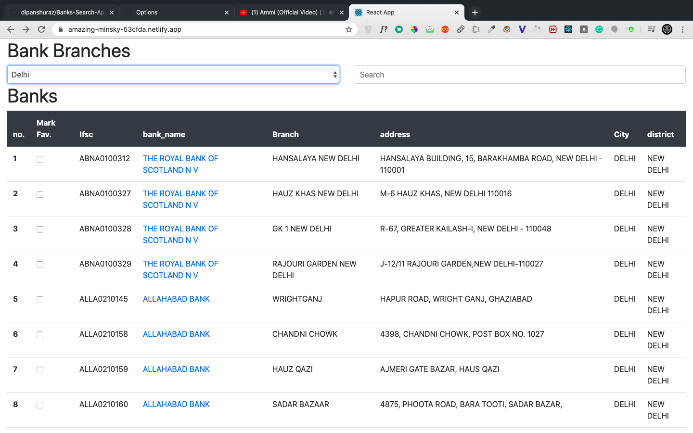
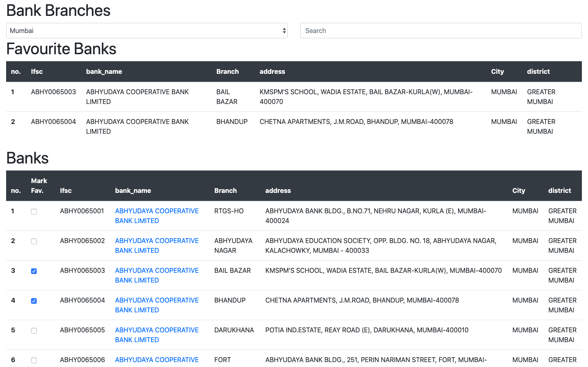
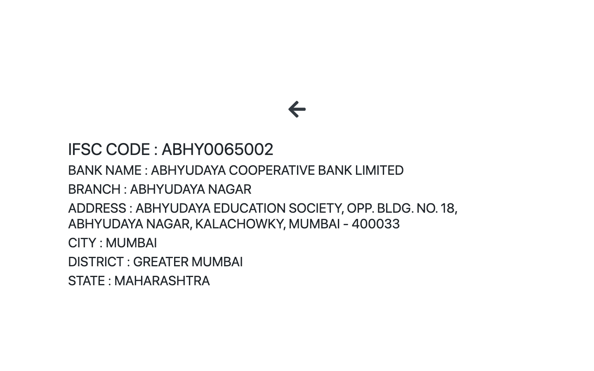
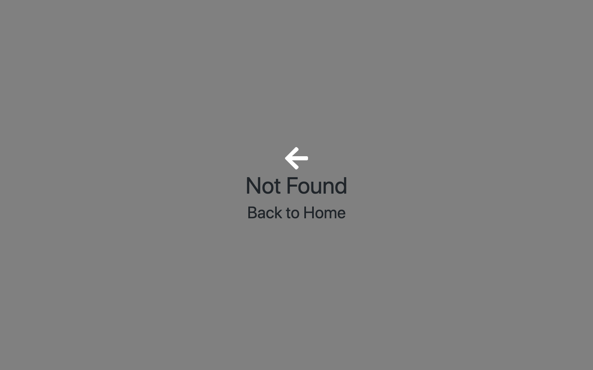

# Banks Search Application - kukuFM

- [x] frontend  - [ **Demo Netlify** ](https://amazing-minsky-53cfda.netlify.app/)
- [x] frontend  - [ **Demo Heroku** ]()

## Problem Statement
FRONT-END WEB DEVELOPER ASSESSMENT

### Instructions:

You need to develop a single page web app (preferably, but not necessarily in AngularJS).
The app should list and search for banks that are fetched from the API mentioned below. There
should be a dropdown for cities (just put in 5 cities in there) and there is a search bar. As I type
in the search area, the table should be dynamically filtered (client-side filtering). Search should
be across all fields.

### Essentials your applications should have:

- [x] 1. bank search screen which would show a list of banks
- [x] 2. user should be able to search by text for the banks, across all the fields (important: there
would be no search button)
- [x] 3. pagination for the results of the search, the user should be able to select page size
- [x] 4. mark some banks as favourites. View banks that were marked as favourites (favourites
should persist state event if the website is refreshed or reloaded)
- [x] 5. API calls should be cached
- [x] 6. your application should be deployed to Heroku / Github pages

### For extra fun, you can try the following:

- [x] 1. clicking on bank name would redirect to a bank page, with a route like banks/{bankid}
that displays the details of the bank
Please note: below mock-ups are for reference only. You are free to do the styling as you
please.

### Deliverables:

- [x] 1. Hosting URL on Heroku / Github pages
- [x] 2. Github repo link to your solution
- [x] 3. Time taken to complete this

## Demo Link
Open Here  - 

[ **Demo Netlify** ](https://amazing-minsky-53cfda.netlify.app/)
 
[ **Demo Heroku** ]()

### Tech / Stack:

 - HTML5
 - CSS3 
 - JavaScript
 - React 
 - Redux
 
### Features implemented:
- [x] Add Employee
- [x] Delete Employee
- [x] Custom Modal
- [x] Toasts
- [x] React Calendar

## Banks Screen Mock-up UI : 

 

## My UI :

Step 1 :

Step 2 : 
 

Step 3 : 
 

Step 4 : 
 

 

 

 

 

This project was bootstrapped with [Create React App](https://github.com/facebook/create-react-app).

## Available Scripts

In the project directory, you can run:

### `npm install`
### `npm start`

Runs the app in the development mode. 
Open [http://localhost:3000](http://localhost:3000) to view it in the browser.

The page will reload if you make edits. 
You will also see any lint errors in the console.
 - Truck Tracking System with Realtime API - Remote State
